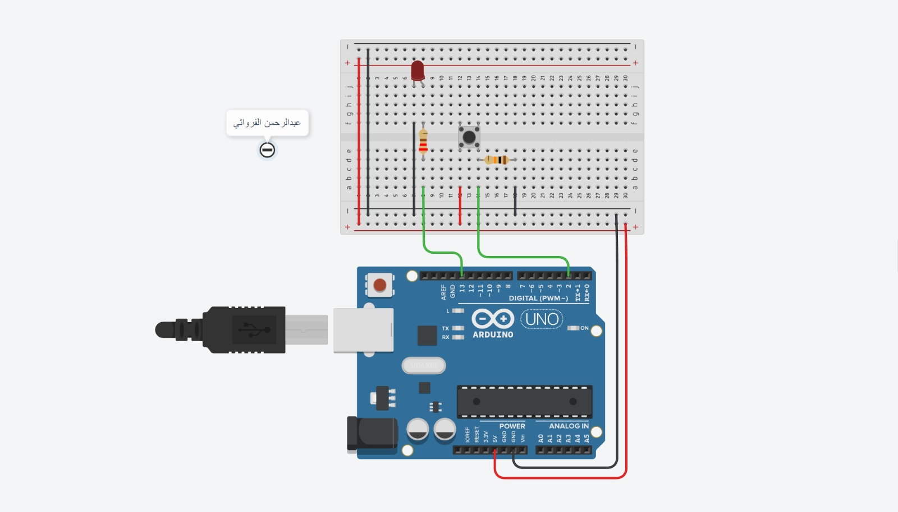

# Turning on the eye as a single light.

## Circuit Components:

Arduino Uno R3

220 Ω Resistor

10 kΩ Resistor

Red LED

Pushbutton

## Circuit Installation Steps:
Connect the Arduino board:

Place the Arduino board on a stable surface.
Connect the LED:

Insert the longer leg (anode) of the LED into a digital pin on the Arduino board (e.g., pin 13).
Connect the shorter leg (cathode) of the LED to the 220-ohm resistor.
Connect the other end of the resistor to the GND (ground) pin on the Arduino board.
Connect the switch/sensor:

Insert one leg of the switch/sensor into a digital pin on the Arduino board (e.g., pin 2).
Connect the other leg of the switch/sensor to the 5V pin on the Arduino board.
If using a push-button switch, connect a 10k-ohm resistor between the pin connected to the switch and the GND pin on the Arduino board to create a pull-down configuration.
Optional: Use a breadboard:

If you have a breadboard, you can connect the components on it to make the connections more organized and secure.
Connect the Arduino board's 5V and GND pins to the power rails on the breadboard.
Connect the power supply:

Connect the Arduino board to a power source, either via USB or an external power supply.
Upload the code:

Connect the Arduino board to your computer using a USB cable.
Launch the Arduino IDE (Integrated Development Environment) software on your computer.
Open a new sketch and copy-paste the code provided in the document.
Select the appropriate board and port from the Arduino IDE's tools menu.
Click on the "Upload" button to compile and upload the code to the Arduino board.
Verify the circuit operation:

Once the code is uploaded successfully, the circuit will start running.
Activate the switch or sensor connected to pin 2, and the LED connected to pin 13 should turn on.
Deactivate the switch or sensor, and the LED should turn off.



## Arduino Code Explanation:

```
void setup()
{
  pinMode(2, INPUT);
  pinMode(13, OUTPUT);
}

void loop()
{
  if (digitalRead(2) == HIGH) {
    digitalWrite(13, HIGH);
  } else {
    digitalWrite(13, LOW);
  }
  delay(10); // Delay a little bit to improve simulation performance
}
```
The code you provided is an example of an Arduino sketch written in the Arduino programming language. It sets up the Arduino board to configure pin 2 as an input and pin 13 as an output in the `setup()` function.

In the `loop()` function, the code checks the state of pin 2 using the `digitalRead()` function. If pin 2 is in a HIGH state, it means that a voltage signal is detected, and the code sets pin 13 to a HIGH state using the `digitalWrite()` function. This turns on an LED or any other device connected to pin 13.

If pin 2 is in a LOW state, indicating no voltage signal, the code sets pin 13 to a LOW state, turning off the LED or device connected to it.

The `delay(10)` statement introduces a 10-millisecond delay between iterations of the loop to improve the performance of the simulation.

This code essentially reads the input state of pin 2 and mirrors it by setting the output state of pin 13 accordingly. If pin 2 is HIGH, pin 13 will be set HIGH, and if pin 2 is LOW, pin 13 will be set LOW.
